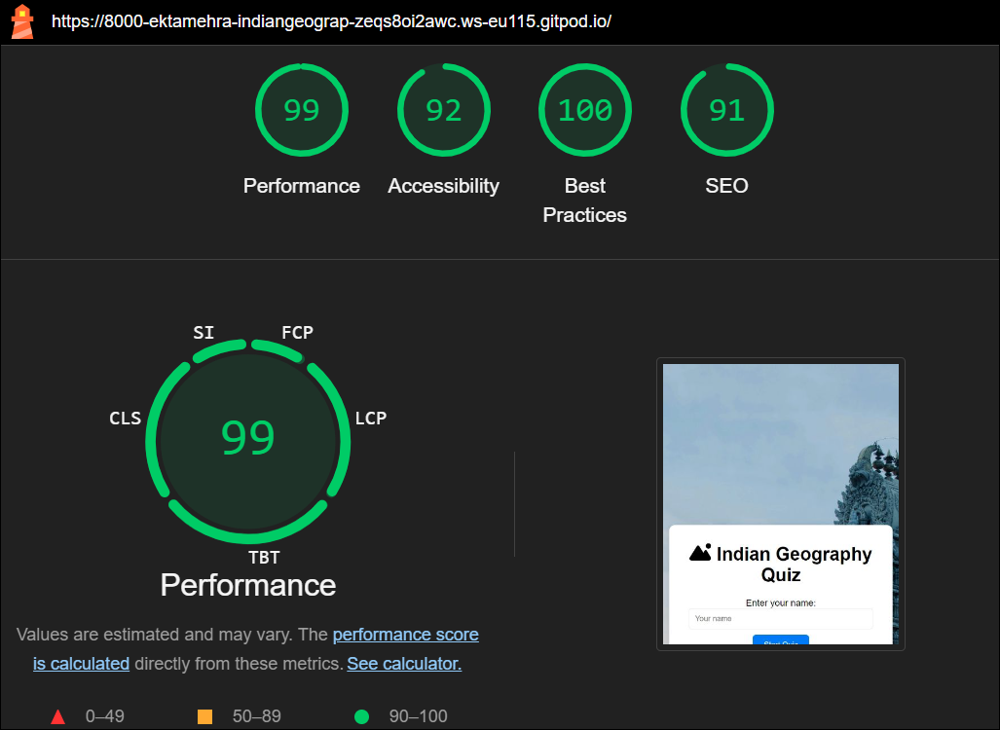

# Indian Geography Quiz

Indian Geography Quiz is an engaging and educational online quiz designed to test and enhance users' knowledge of the diverse geography of India. This project aims to provide an interactive platform where users can challenge themselves on various aspects of Indian geography, including states, capitals, rivers, mountains, and more. The quiz is ideal for students, trivia enthusiasts, and anyone interested in learning more about the geographical features of India. The Indian Geography Quiz is fully responsive and accessible across devices, ensuring a seamless experience for all users.

## Features

This section provides an overview of the key features of the Indian Geography Quiz, explaining how each feature contributes to the overall user experience and learning objectives.

### Existing Features

- The Indian Geography Quiz Logo and Heading

The Indian Geography Quiz logo and heading are prominently displayed at the top of the page, making it easy for users to identify the quiz and understand its focus. This enhances brand recognition and sets the tone for the quiz.

- The Quiz Interface

The quiz interface is where users will interact with the quiz. The users start by entering their name and pressing the start quiz button.

- The Question Section

Once the quiz starts, it then presents one multiple-choice question at a time, with four possible answers. Users can select an answer by clicking on it, which is then highlighted for confirmation. This clear and intuitive design allows users to focus on the quiz content. The question section displays the current geography-related question, allowing users to engage with the content. An answer box is provided where users can submit their responses. Immediate feedback is given through a pop-up message indicating whether the answer is correct or incorrect. This allows users to review their knowledge and identify areas for improvement.

- End of Quiz Summary

At the end of the quiz, after the user selects the answer to the last question an end quiz button pops up in place of the 'next question' button to convey that this is the end of the quiz. At the same time, they are provided with a summary of their total score. Once the quiz is completed and the score pops up, users can click the 'okay' button to restart the quiz and get the perfect score on their next attempt.

## Features Left to Implement

### Leaderboard

- A leaderboard feature will be added to allow users to compare their scores with others, fostering a sense of competition and community. This feature will enhance user engagement and motivate repeat plays.
- A feature that will shuffle the questions automatically when the users restart the quiz.

### Timed Quiz Mode

A timed quiz mode will be implemented to increase the challenge by limiting the time available to answer each question. This feature will appeal to users who enjoy time-based challenges and wish to test their quick-thinking abilities.

## Testing

Comprehensive testing has been conducted to ensure that all features and buttons of the Indian Geography Quiz work as intended and provide a smooth and intuitive user experience. The quiz has been tested across various browsers and screen sizes to guarantee compatibility and responsiveness.

## Validator Testing

- HTML
  No errors were returned when passing through the official [W3C validator](https://validator.w3.org/nu/?showsource=yes&doc=https%3A%2F%2Fektamehra.github.io%2FIndian-Geography-Quiz%2F).

- CSS
  No errors were found when passing through the official [Jigsaw validator](https://jigsaw.w3.org/css-validator/validator?uri=https%3A%2F%2Fvalidator.w3.org%2Fnu%2F%3Fshowsource%3Dyes%26doc%3Dhttps%253A%252F%252Fektamehra.github.io%252FIndian-Geography-Quiz%252F&profile=css3svg&usermedium=all&warning=1&vextwarning=&lang=en).

- JavaScript
  No errors were found when passing through the official [JSHint validator](https://jshint.com/).

  The following metrics were returned:

  - There are 8 functions in this file.
  - Function with the largest signature takes 2 arguments, while the median is 0.
    The largest function has 15 statements in it, while the median is 2.5.
  - The most complex function has a cyclomatic complexity value of 4 while the median is 1.5.

## Accessibility Performance

Here is the accessibility performance result of our webpage:

## Unfixed Bugs

- There was a function issue that would let users select another answer if the first one they picked was wrong and then would calculate the wrong score. This bug was fixed by adding a function that doesn't let users select an answer after their first attempt.
- When the quiz ended, the 'next question' button continued to come up along with the 'end quiz' button which can be confusing for the users. This bug was fixed by correcting a spelling mistake in one of the javascript codes.

Currently, there are no known unfixed bugs. All reported issues have been addressed to ensure optimal functionality and user experience. Any potential improvements or enhancements will be considered in future updates.

## Deployment

The Indian Geography Quiz was deployed using GitHub Pages. The steps for deployment are as follows:

- In the GitHub repository, navigate to the Settings tab.
- From the Source section drop-down menu, select the master branch.
- Once the master branch has been selected, the page will automatically refresh, and a ribbon will display indicating the successful deployment.

The live link to the project can be found here: [Indian Geography Quiz](https://ektamehra.github.io/Indian-Geography-Quiz/).

## Credits

### Content

The quiz questions and answers were crafted using information from [Google](https://www.google.com/) on Indian geography.

### Media

The icons and images used in the quiz were sourced from [Font Awesome](https://fontawesome.com/) and [Pexels](https://www.pexels.com/).

### Acknowledgements

Inspiration and guidance for the quiz interface were derived from various [YouTube](https://www.youtube.com/) tutorials and educational resources on JavaScript and web development.
